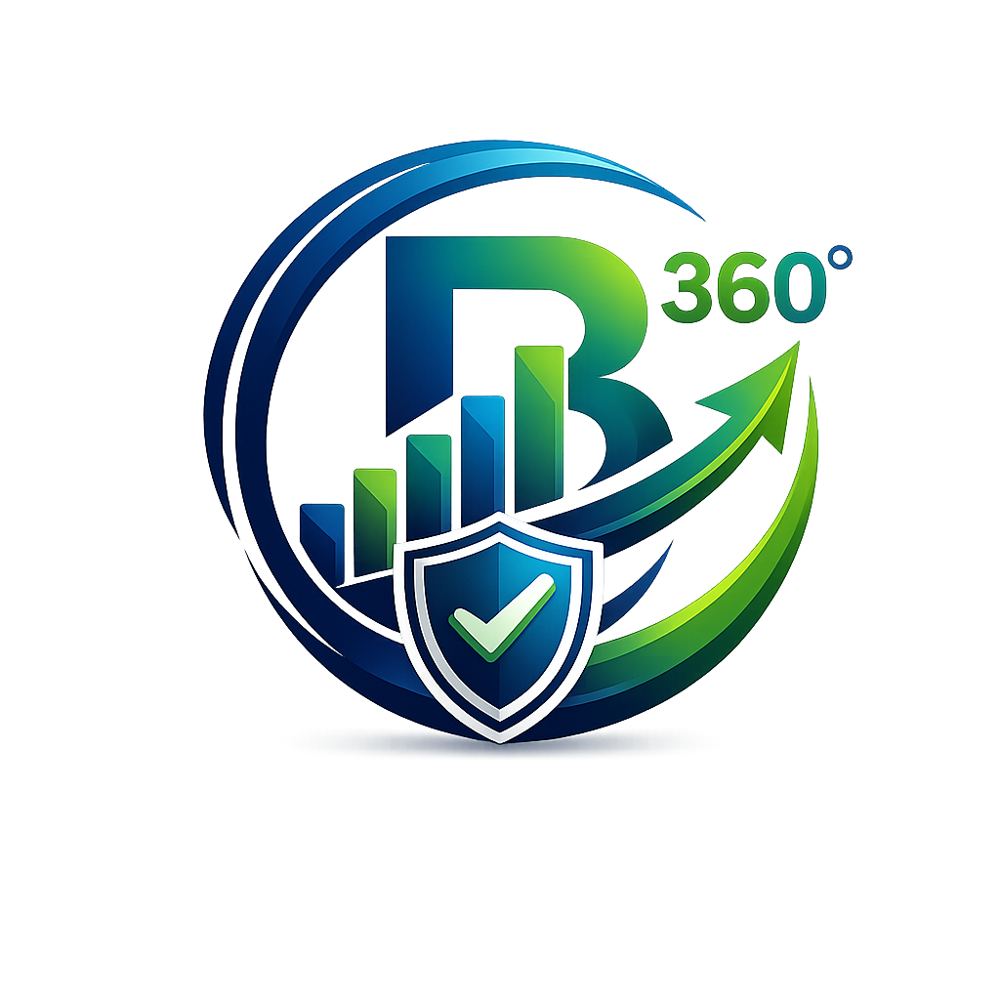

<div align="center">
  
  <h1>BizFlow360</h1>
  <p><em>Financial clarity for every MSME.</em></p>
</div>

**A Machine Learning-Based Early Warning System for Predicting Financial Distress Among Kenyan MSMEs**


---

## 📋 Project Overview

BizFlow360 is a capstone project developed by **Team Maridex** to help Kenyan Micro, Small, and Medium Enterprises (MSMEs) identify early signs of financial distress using machine learning.

### 🎯 Objectives

- Identify key financial indicators of MSME distress
- Build and compare predictive models (Logistic Regression, Random Forest, XGBoost, LightGBM)
- Deploy a user-friendly Streamlit dashboard for real-time risk assessment
- Provide actionable insights and recommendations

---

## 👥 Team Maridex

| Member | Role | Registration Number |
|--------|------|---------------------|
| **Edusei Mikel Lisamba** | Team Leader & ML Integration Lead | ST01/0149/2025 |
| **Mutua Denis Mutio** | Data Engineering & EDA Lead | ST01/0046/2025 |
| **Marion Muthoni Mwenda** | Research, Documentation & Ethics Lead | ST01/0144/2025 |
| **Yvette Akinyi Odeny** | MVP, Deployment & Presentation Lead | ST01/33452/2025 |

---

## 📁 Project Structure

This project is organized by team member roles for clarity:

```
BizFlow360/
│
├── 📁 data_eda/ 🕵️ Denis's workspace
│ ├── raw/ (Original datasets)
│ ├── processed/ (Cleaned data)
│ ├── synthetic/ (Sample data)
│ ├── metadata/ (Data dictionaries)
│ ├── notebooks/ (EDA notebooks)
│ └── scripts/ (Data scripts)
│
├── 📁 ml_models/ 👑 Edusei's workspace
│ ├── notebooks/ (ML notebooks)
│ ├── models/ (Trained models & metrics)
│ └── scripts/ (ML scripts)
│
├── 📁 docs/ 📚 Marion's workspace
│ ├── proposal/ (Chapters 1-3)
│ ├── literature/ (Research papers)
│ ├── final_report/ (Chapters 4-6)
│ ├── presentation/ (Slides)
│ ├── ethics/ (KDPA compliance)
│ └── user_manual/ (Documentation)
│
├── 📁 streamlit_app/ 🎨 Yvette's workspace
│ ├── app/ (Streamlit code)
│ ├── deployment/ (Deployment config)
│ ├── notebooks/ (App testing)
│ └── config/ (Streamlit config)
│
├── README.md (This file)
├── requirements.txt (Dependencies)
├── requirements-dev.txt (Dev dependencies)
└── .gitignore (Git ignore rules)

```

---

## 🛠️ Installation

### Prerequisites

- Python 3.10 or higher
- pip

### Setup

1. **Clone the repository:**
   ```bash
   git clone https://github.com/mikeledusei/BizFlow360.git
   cd BizFlow360

   ```

 2. **Create a virtual environment:**
    ```bash
    python3 -m venv venv
    source venv/bin/activate  # On Windows: venv\Scripts\activate
    ```
 3. **Install dependencies:**
    ```bash
    pip install -r requirements.txt
    pip install -r requirements-dev.txt
    ```
---

## 🚀 Usage

### For Team Members
- Each team member should work within their designated folder:
    - Denis: `data_eda/`
    - Edusei: `ml_models/`
    - Marion: `docs/`
    - Yvette: `streamlit_app/`

### Running the Streamlit App

```bash
cd streamlit_app
streamlit run app/main.py
```
---

## 📊 Models
We compare four classification models:

1. Logistic Regression(Baseline)
2. Random Forest
3. XGBoost
4. LightGBM

Evaluation metrics: Accuracy, Precision, Recall, F1-Score, ROC-AUC

---

## 📝 Git Workflow

**Golden Rule**: Never push directly to main!

1. Create a feature branch: git checkout -b feature/your-task
2. Do your work and test it
3. Commit: git commit -m "feat: description"
4. Push: git push -u origin feature/your-task
5. Open a Pull Request to develop
6. Team Leader reviews and merges

---

## 📄 Documentation

**Proposal*: `docs/proposal/`\
**Final Report*: `docs/final_report/`\
**Ethics & Compliance*: `docs/ethics/`\
**User Manual*: `docs/user_manual/`

---

## 📧 Contact

For questions about this project, contact:\
Team Leader: Edusei Mikel Lisamba\
Email: lisambaedusei@gmail.com\
Phone: +254100505954

Institution: Open University of Kenya\
Supervisor: Dr. Irene Sitawa\
Phone: +254721575114

---

## 📜 License

This project is developed for academic purposes as part of the BSc Data Science capstone requirement, at the Open University of Kenya.

Financial clarity for every MSME. 💡

