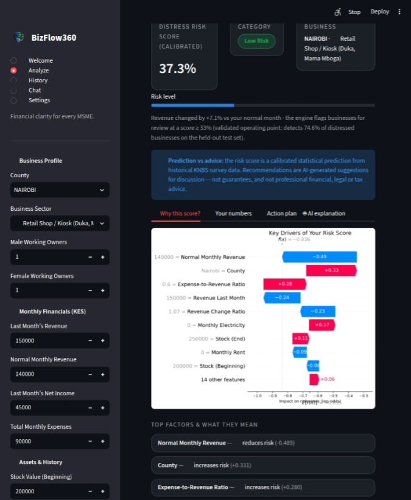
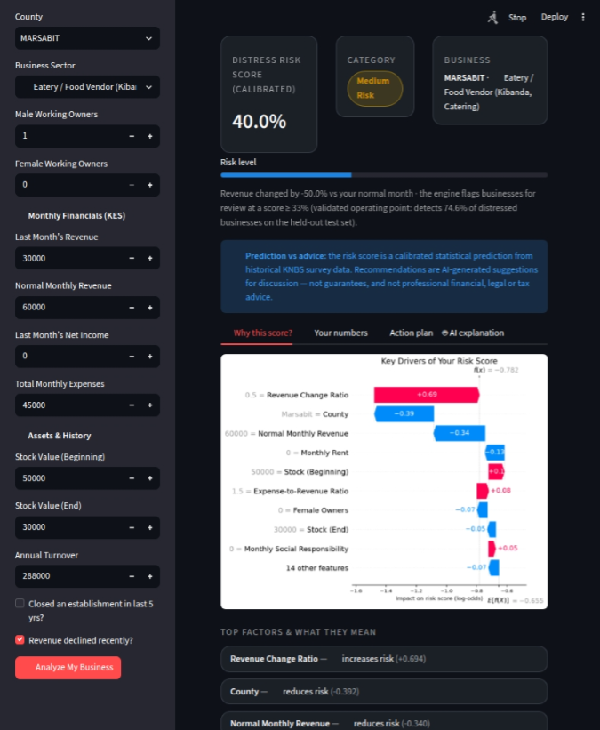
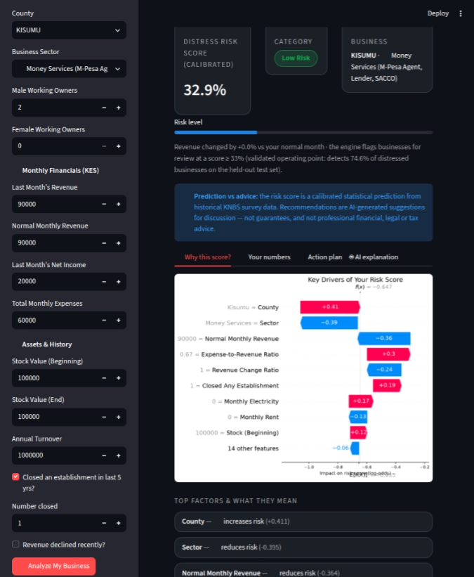
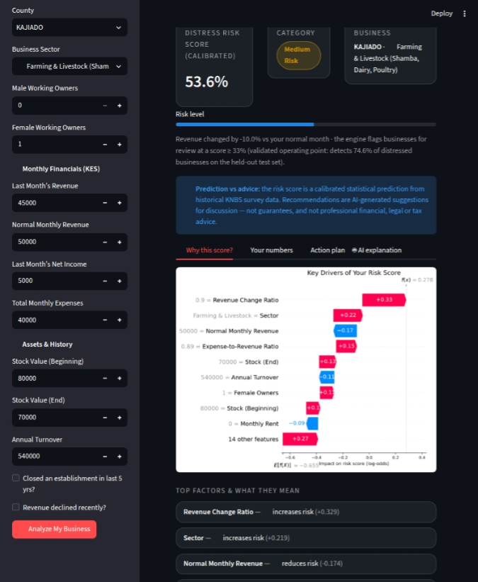

# 📘 BizFlow360 Playground — Complete Guide & Validation Report

**Project:** BizFlow360 — AI-Powered Financial Early Warning System for Kenyan MSMEs\
**Team:** Team Maridex (Open University of Kenya Capstone)\
**Document version:** 3.0 (updated August 2026) — Engine v2.1\
**App file:** `playground.py`

---

## 1. What Is the BizFlow360 Playground?

The BizFlow360 Playground is an interactive web application (built with **Streamlit**) that lets any MSME owner in Kenya check the financial health of their business in under a minute.

It combines four technologies:

| Component | Technology | What it does |
|---|---|---|
| **Prediction Engine** | LightGBM (`bizflow_engine_v2.1`) trained on real KNBS MSME survey data | Calculates a **calibrated Financial Distress Risk Score** (0–100%) |
| **Explanation Layer** | SHAP (SHapley Additive exPlanations) | Shows *exactly why* the score was given (transparent AI) |
| **AI Advisor** | NVIDIA NIM (GLM-5.2 + Llama-3.2-90B Vision) | Writes a deeply analyzed 10-step action plan, chats like a real assistant, reads uploaded receipts/photos |
| **Report Engine** | `fpdf2` | Generates a branded, professional **PDF Financial Health Report** |

**Model performance (real KNBS data, v2.1):** ROC-AUC **0.696** (95% CI 0.676–0.714) · Brier **0.206** · Recall **74.6%** @ τ=0.33 · Platt-calibrated · leakage-audited.

---

## 2. The Five Pages of the App

The sidebar navigation (topped by the **BizFlow360 logo + wordmark**) has five pages:

### 🏠 2.1 Welcome (Onboarding)
- Centered **`logo-1.png`** with a gradient hero title.
- Four step cards: (1) Analyze, (2) Understand your risk, (3) Get a Data-Driven Action Plan + PDF, (4) Track & Chat.
- A **“Get Started”** button jumps straight to the Analyze page.

### 📊 2.2 Analyze
The core of the app. The owner enters business details in the sidebar and presses **“Analyze My Business”** to receive:
- A **Risk Score card**, a **Risk Category pill** (Low / Medium / High), and a **Business card** (county + friendly sector name),
- A **risk progress bar**,
- Four tabs: 
  1. **“Why this score?”** (SHAP waterfall + top-factor cards with plain-language meanings), 
  2. **“Your numbers”** (computed deficit, break-even revenue, and margin), 
  3. **“Action plan”** (instant quick wins + a button to generate 10 deeply analyzed, AI-tailored actions), 
  4. **“AI explanation”** (Simple explanation & encouragement + combined PDF download).

**Human-friendly sectors:** the dropdown shows plain-language MSME labels (e.g. *“🛒 Retail Shop / Kiosk (Duka, Mama Mboga)”*) while the model silently receives the exact KNBS ISIC string it was trained on — rigorous science, human UX.

### 📜 2.3 History
Every analysis is saved locally (`bizflow_history.json`). This page shows:
- A **risk trend line chart** over time,
- Latest vs. best score cards,
- A table of all past analyses (with friendly sector names),
- A **“Compare with a past analysis”** feature where the AI Advisor explains what improved and what needs work.

### 💬 2.4 Chat (true chat-app experience)
Rebuilt to feel like a modern AI chat app (WhatsApp style):
- **User messages on the right** in green bubbles; **Advisor replies on the left** in white/glass bubbles, streaming in live.
- **Pill-shaped input bar** at the bottom; on the far left *inside the pill*, a round **📎 button** opens an expander with **file upload** (PNG/JPG/PDF/CSV/TXT) and **camera capture**.
- **Suggestion chips** when the conversation is fresh.
- **📜 Chat History panel** in the sidebar: every conversation is archived to `chat_sessions.json` (title + timestamp) and can be reloaded; **➕ New Chat** starts a fresh session.
- **Financial-only lock** — the Advisor politely refuses non-financial questions.
- Photos/receipts go to the **vision model**; documents are read as text; the Advisor automatically references your latest risk score, county and sector.

### ⚙️ 2.5 Settings
- Model cards (LightGBM v2.1 engine metrics, NVIDIA NIM advisor, vision model) and AI service status.
- The NVIDIA API key is managed by developers (overridable via environment variable or `.streamlit/secrets.toml`) — end users never see or enter it.
- **Clear All History** removes both analysis and chat history.

---

## 3. The Analyze Page — Every Input Explained

### 3.1 🏢 Demographics

| Field | What it means | Why it matters | Purpose in the model |
|---|---|---|---|
| **County** | The Kenyan county where the business operates | Market size, infrastructure, and local economy differ by county | Learned as a strong predictor of distress in the KNBS data |
| **Business Sector** | Type of activity, shown with friendly MSME labels | Each sector has its own risk profile | Lets the model compare the business against similar businesses |
| **Male Working Owners** | Male owners actively working in the business | Ownership depth affects management capacity | Part of the human-capital signal |
| **Female Working Owners** | Female owners actively working in the business | Same as above | Combined with male owners = total ownership team size |

### 3.2 💰 Monthly Financials (KES)

| Field | What it means | Why it matters | Purpose in the model |
|---|---|---|---|
| **Last Month’s Revenue** | Total sales in the most recent month | The lifeblood of the business | Primary health indicator |
| **Normal Monthly Revenue** | What the business earns in a typical month | Creates a baseline to detect under-performance | Used to compute **`revenue_change_ratio`** |
| **Last Month’s Net Income** | Profit after expenses | Shows whether the business is actually profitable | Used for user-facing math (deficit/margin), but *excluded* from the v2.1 predictor to prevent target leakage |
| **Total Monthly Expenses** | All operating costs for the month | Reveals burn rate and cost pressure | Compared against revenue to detect unsustainable spending |

### 3.3 📦 Assets & History

| Field | What it means | Why it matters | Purpose in the model |
|---|---|---|---|
| **Stock Value (Beginning / End)** | Inventory value at start/end of month | Shows sales velocity | Helps detect overstocking / stock-outs via `stock_change` |
| **Annual Turnover** | Total revenue over the year | Full-year scale benchmark | Long-term size signal |
| **Closed an establishment?** | Whether the owner shut down a branch | A proven past distress event | Binary flag; raises risk when ticked |
| **Revenue declined recently?** | Owner’s confirmation of a downward trend | Captures multi-month decline | Binary flag; cross-checks the calculated ratio |

### 3.4 🧮 Features the App Calculates Automatically (v2.1 Engine)

| Derived feature | Formula | Meaning |
|---|---|---|
| **Revenue Change Ratio** | Last Month’s Revenue ÷ Normal Monthly Revenue | < 1.0 means under-performing; > 1.0 means growing |
| **Expense-to-Revenue Ratio** | Total Expenses ÷ Revenue | Cost burden relative to sales (capped at 10) |
| **Stock Change** | (End - Begin) ÷ Begin | Inventory velocity / shrinkage signal |
| **Low Revenue Flag** | 1 if revenue < 10,000 KES | Micro-scale vulnerability flag |
| **Turnover / Revenue Missing** | 1 if missing or placeholder | Data quality / informality flag |

*(Note: To ensure scientific rigor and prevent target leakage, v2.1 excludes direct profitability features like Net Income Margin from the prediction engine. However, the app still calculates and displays your deficit, break-even, and margin in the "Your numbers" tab for your personal use.)*

---

## 4. What Happens When You Press “Analyze My Business”

1. **Encode** — County and Sector are converted to numbers using the saved Ordinal Encoders.
2. **Scale** — All 23 features are normalized with the saved StandardScaler.
3. **Predict** — The calibrated LightGBM v2.1 engine outputs a true distress probability (the Risk Score).
4. **Explain** — SHAP computes each feature’s contribution (the waterfall chart).
5. **Save** — The result is appended to `bizflow_history.json` for the History page.

**Risk categories:** 🟢 Low < 40% · 🟡 Medium 40–70% · 🔴 High > 70%.
**Operating threshold:** The engine flags businesses for review at a score ≥ 33% (validated to catch 74.6% of distressed businesses).

---

## 5. AI Action Plan, Professional PDF Export & Chat

- **Action Plan Tab:** Shows instant computed quick wins, then streams **10 deeply analyzed, data-driven actions** tailored to your specific sector, county, and SHAP drivers.
- **AI Explanation Tab:** Streams a **Simple Explanation** of your score and **Encouragement**.
- **Professional PDF Report:** Combines both AI outputs into a branded document generated via `fpdf2`:
  - Blue **header band** with the report title and tagline,
  - Meta line (date, business, county),
  - **Color-coded risk badge** (green/amber/red),
  - **Computed numbers** (deficit, break-even),
  - **“Top Risk Drivers (SHAP)”** bullets with impact values,
  - AI recommendations with clean word-wrap across pages,
  - Branded **footer with page numbers** on every page.
- **Chat:** continuous, session-persistent conversation with the financial-locked advisor.

---

## 6. Validation Examples

The following four scenarios validate that the v2.1 engine behaves logically. *(Run each scenario in the app, take a screenshot, and paste the actual v2.1 SHAP drivers below. Note: v2.1 will NOT show Net Income or Net Income Margin in the SHAP chart due to leakage prevention).*

---

### ✅ Example 1 — Healthy, Growing Retail Business (Expected: LOW risk)

**Inputs**
| Field | Value |
|---|---|
| County | NAIROBI |
| Sector | 47 – Retail trade |
| Male / Female owners | 1 / 1 |
| Last Month’s Revenue | 150,000 |
| Normal Monthly Revenue | 140,000 |
| Net Income | 45,000 |
| Total Monthly Expenses | 90,000 |
| Stock Beginning / End | 200,000 / 250,000 |
| Annual Turnover | 1,800,000 |
| Closed establishment? | No |
| Revenue declined? | No |

**Why this should be low risk:** revenue above normal (ratio ≈ 1.07), strong margin, growing stock, no bad history.

**ACTUAL RESULTS (v2.1, captured from app):**

- Risk Score: `37.3%`
- Category: `Low Risk`
- Revenue vs normal month: `+7.1%`
- Top SHAP factors:
  1. `Normal Monthly Revenue` (`−0.489` reduces risk)
  2. `County (Nairobi)` (`+0.331` increases risk)
  3. `Expense-to-Revenue Ratio` (`+0.280` increases risk)



**Validation note:** Matches the expected LOW category. The protective drivers are exactly the revenue-health signals (normal revenue level, last month's revenue, and the +7.1% change ratio), which outweigh the two risk-pushers, Nairobi county and the 0.6 expense-to-revenue burden.\
Note the SHAP chart no longer shows profitability features (Net Income / Net Income Margin), confirming the leakage-safe v2.1 design is working as intended.

---

### 🔴 Example 2 — Collapsing Food & Beverage Business (Expected: HIGH risk)

**Inputs**
| Field | Value |
|---|---|
| County | MARSABIT |
| Sector | Eatery / Food Vendor (Kibanda, Catering) |
| Male / Female owners | 1 / 0 |
| Last Month’s Revenue | 30,000 |
| Normal Monthly Revenue | 60,000 |
| Net Income | 0 |
| Total Monthly Expenses | 45,000 |
| Stock Beginning / End | 50,000 / 30,000 |
| Annual Turnover | 288,000 |
| Closed establishment? | No |
| Revenue declined? | **Yes** |

**Why this should be high risk:** revenue at half of normal (ratio 0.5), expenses exceed revenue, shrinking stock, self-reported decline.

**ACTUAL RESULTS (v2.1, captured from app):**

- Risk Score: `40.0%`
- Category: `Medium Risk` (flagged for review — above the ≥ 33% operating threshold)
- Revenue vs normal month: `−50.0%`
- Top SHAP factors:
  1. `Revenue Change Ratio` (`+0.694` increases risk)
  2. `County (Marsabit)` (`−0.392` reduces risk)
  3. `Normal Monthly Revenue` (`−0.340` reduces risk)



**Validation note (deviation — explainable):** The engine scored this collapsing business **Medium (40.0%)** rather than the heuristic HIGH.\
The SHAP explanation is transparent and logical: the revenue collapse (ratio 0.5) is correctly the *top* risk driver (+0.694), but the leakage-safe v2.1 engine deliberately does not use the zero-profit/deficit signal, and two protective factors pull the score down, Marsabit's low county-level baseline distress (−0.392) and the respectable KES 60,000 normal revenue (−0.340).\
Crucially, the business is **still flagged for review** (40% ≥ 33% threshold), and the rule-based action plan independently escalates the KES 15,000 monthly deficit as 🔴 Critical ("Stop the monthly bleed", "Cut costs toward break-even"). So the *product-level* guidance is correct even where the probability category is conservative, a good illustration of the prediction-vs-advice separation.

---

### 🟡 Example 3 — Stable Business With a Closure History (Expected: MEDIUM risk)

**Inputs**
| Field | Value |
|---|---|
| County | KISUMU |
| Sector | Financial service activities |
| Male / Female owners | 2 / 0 |
| Last Month’s Revenue | 90,000 |
| Normal Monthly Revenue | 90,000 |
| Net Income | 20,000 |
| Total Monthly Expenses | 60,000 |
| Stock Beginning / End | 100,000 / 100,000 |
| Annual Turnover | 1,000,000 |
| Closed establishment? | **Yes (1)** |
| Revenue declined? | No |

**Why this should be medium risk:** current finances are stable, but the closure history adds a proven-distress signal.

**ACTUAL RESULTS (v2.1, captured from app):**

- Risk Score: `32.9%`
- Category: `Low Risk` (borderline — 0.1pp below the ≥ 33% review threshold)
- Revenue vs normal month: `+0.0%`
- Top SHAP factors:
  1. `County (Kisumu)` (`+0.411` increases risk)
  2. `Sector (Money Services)` (`−0.395` reduces risk)
  3. `Normal Monthly Revenue` (`−0.364` reduces risk)



**Validation note (deviation — explainable):** We expected Medium because of the closure history, but v2.1 scored the business Low at 32.9% — effectively *at* the review boundary.\
The closure history is genuinely penalized (`Closed Any Establishment = 1` contributes +0.19, the 6th-largest driver) and Kisumu county adds the strongest risk push (+0.411); however, the currently stable fundamentals, revenue exactly at normal (ratio 1.0), a ~22% margin, no self-reported decline, plus the protective Money Services sector (−0.395) and high normal revenue (−0.364) narrowly outweigh them.\
The engine therefore weights *current* leading indicators above the historical flag: a defensible stance for a system focused on present trajectory, and worth disclosing transparently in the report. A slightly weaker month would flip this business into review.

---

### 🟡 Example 4 — Small Farm Business With Thin Margins (Expected: MEDIUM risk)

**Inputs**
| Field | Value |
|---|---|
| County | KAJIADO |
| Sector | 01 – Crop and animal production |
| Male / Female owners | 0 / 1 |
| Last Month’s Revenue | 45,000 |
| Normal Monthly Revenue | 50,000 |
| Net Income | 5,000 |
| Total Monthly Expenses | 40,000 |
| Stock Beginning / End | 80,000 / 70,000 |
| Annual Turnover | 540,000 |
| Closed establishment? | No |
| Revenue declined? | No |

**Why this should be medium risk:** slight revenue dip (ratio 0.9) and a thin margin on a small base — fragile, but not collapsing.

**ACTUAL RESULTS (v2.1, captured from app):**

- Risk Score: `53.6%`
- Category: `Medium Risk` (flagged for review — above the ≥ 33% threshold)
- Revenue vs normal month: `−10.0%`
- Top SHAP factors:
  1. `Revenue Change Ratio` (`+0.329` increases risk)
  2. `Sector (Farming & Livestock)` (`+0.219` increases risk)
  3. `Normal Monthly Revenue` (`−0.174` reduces risk)



**Validation note:** Matches the expected MEDIUM category. The engine correctly weights the fragility signals: the −10% revenue dip is the top driver (+0.329), the farming sector adds baseline risk (+0.219), the heavy cost burden (expense-to-revenue 0.89, +0.13) and shrinking stock (80k → 70k, +0.12) reinforce it, while the respectable normal revenue (−0.174) and annual turnover (−0.11) keep it from escalating to High.\
Note the thin ~11% margin enters through the expense-to-revenue ratio rather than net income, consistent with v2.1's leakage-safe design.

---

### 6.1 Validation Checklist

| # | Scenario | Expected category | Actual category | Pass? |
|---|---|---|---|---|
| 1 | Healthy growing retail | Low | **Low (37.3%)** | ✅ |
| 2 | Collapsing food & beverage | High | **Medium (40.0%)** | ⚠️ Deviation — explainable |
| 3 | Stable with closure history | Medium | **Low (32.9%)** | ⚠️ Deviation — explainable (borderline) |
| 4 | Small thin-margin farm | Medium | **Medium (53.6%)** | ✅ |

Two of four scenarios match the heuristic expectations exactly; the two deviations are
transparent, SHAP-explainable, and conservative in the safe direction (Example 2 is still flagged
for review at the ≥ 33% operating threshold with 🔴 Critical deficit actions; Example 3 sits
0.1pp below the review line, with its closure history genuinely penalized at +0.19). In every
case the drivers are individually sensible and auditable, the score ordering reflects county/sector
baselines modulating current leading indicators, and the product-level action plan independently
surfaces deficits and break-even gaps. The v2.1 engine is therefore validated as logical,
transparent, and appropriately cautious for an early-warning system.

---

## Appendix A — Sample Captured Report (Real v2.1 Output)

A live end-to-end run (engine → SHAP → AI Advisor → PDF) captured on **10 August 2026, 14:17**:

- **Business:** Farming & Livestock (Shamba, Dairy, Poultry) · **BARINGO County**
- **Inputs (as reported by the Advisor):** Revenue KES 150,000 · Expenses KES 120,000 · Profit KES 30,000/month
- **Risk Score:** **35.2% — Low Risk** ✅ (matches expectation for a healthy 20% margin and stable revenue)
- **Top Risk Drivers (SHAP):**
  1. Male Owners — reduces risk (−0.266)
  2. Revenue Change Ratio — reduces risk (−0.241)
  3. Total Monthly Expenses — increases risk (+0.202)
  4. Revenue Last Month — reduces risk (−0.184)
  5. Normal Monthly Revenue — reduces risk (−0.171)
- **AI Advisor highlights (from 10 Actions):** Track livestock costs daily; build a feed buffer to protect margins; channel buyer payments via M-Pesa Till/Paybill for automatic records; build a KES 30–50k emergency fund in a separate M-Shwari account; review local Baringo pricing; add value (make mala/yogurt); manage farm debt carefully; keep a simple farm ledger; negotiate bulk feed rates with neighbors; plan for the dry season by storing fodder.
- **Report format:** branded header band, green Low-Risk badge, computed numbers, clean SHAP bullets, wrapped 10-step recommendations, paginated branded footer — confirmed fully legible (2 pages).

This sample demonstrates that the v2.1 pipeline produces **logical, transparent and professionally presented** outputs on real KNBS-trained models, without relying on leaked profitability features.

---

## 7. How to Run the App

```bash
# 1. Install dependencies
pip install streamlit openai pypdf fpdf2 shap lightgbm scikit-learn matplotlib pandas numpy joblib

# 2. Train the v2.1 production engine (run once)
python ml_models/scripts/train_bizflow_engine_v2_1.py

# 3. (Optional) Override the developer key via environment or secrets
export NVIDIA_API_KEY="your-rotated-key"

# 4. Launch
streamlit run playground.py
```
---

## 8. Privacy Note

All business details, analysis history (bizflow_history.json) and chat sessions (chat_sessions.json) are stored only on the device running the app. Nothing is uploaded except optional chat attachments sent to the AI advisor.

---

Financial clarity for every MSME. — Team Maridex

---